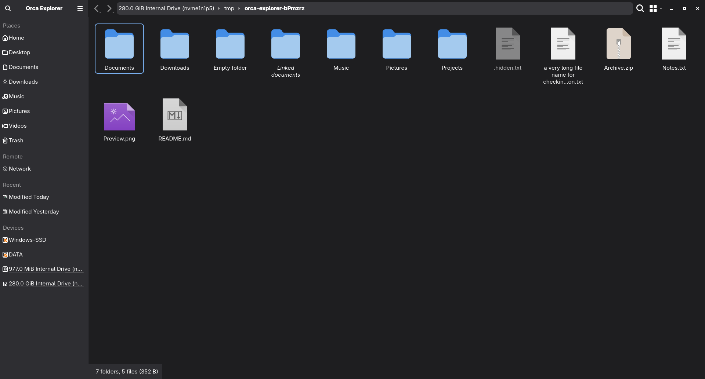

# Orca Explorer

Orca Explorer is an independent file manager fork based on **KDE Dolphin 26.08.2**, maintained by **colozha**. Version **0.1.0** is under development. It preserves Dolphin's file management features while offering a GNOME Files inspired appearance as the default for new configurations.

This project is not an official KDE application and is not affiliated with GNOME's Orca screen reader. The repository URL below is the intended publication destination; availability is not implied.



## Features

- Tabs, split views, breadcrumbs, editable paths and keyboard navigation.
- File previews, search, filtering, remote KIO locations and device integration.
- Places, bookmarks, information/folders/terminal panels and version control plugins.
- GNOME Files inspired light/dark appearance and **Dolphin Classic** appearance.
- Separate application identity, settings and storage for installation alongside Dolphin.

Actual application screenshots and validation results are recorded in [docs/VALIDATION.md](docs/VALIDATION.md). The reference Nautilus screenshots are not screenshots of Orca Explorer.

## Dependencies

C++20, CMake 3.16+, Qt 6.4+, KDE Frameworks 6.23+, Extra CMake Modules and the development packages for the frameworks listed in `CMakeLists.txt` are required. Qt GUI private development headers are required by the upstream build with Qt 6.10 or newer. Optional Baloo support requires matching **Baloo Widgets 26.08.2 or newer**, independent of the fork version. KIO workers, thumbnailers, Konsole's terminal part and VCS plugins come from their respective packages.

No Adwaita-Qt or additional theme framework is required. Telemetry is disabled for fork builds.

## Build and install alongside Dolphin

```sh
cmake -S . -B build -G Ninja \
  -DCMAKE_BUILD_TYPE=RelWithDebInfo \
  -DCMAKE_INSTALL_PREFIX="$HOME/.local" \
  -DBUILD_TESTING=ON
cmake --build build
ctest --test-dir build --output-on-failure
cmake --install build
orca-explorer
```

Ensure `$HOME/.local/bin` is on `PATH`. Install only from the fork build tree. Fork libraries are installed under `lib/orca-explorer` (or the platform's `lib64` equivalent) and use relative RPATHs. The launcher's application ID is `io.github.colozha.OrcaExplorer`. Installation does not select a default file manager or register the global `org.freedesktop.FileManager1` bus service.

Settings use `orca-explorerrc`; state, application data, cache, bookmarks and folder view properties use separate Orca storage. Dolphin configuration is not imported automatically. See [distribution and integration](docs/DISTRIBUTION.md).

## Appearance

Open **Settings → Configure Orca Explorer → Interface → Appearance**. Choose **GNOME Files** or **Dolphin Classic**. Apply saves the choice; reopen the application to activate it. Existing saved zoom, fonts, panel layout and folder preferences take precedence over appearance defaults. Window Color Scheme continues to support explicit user choices and automatic light/dark selection.

On Fedora GNOME Wayland the top toolbar can act as an integrated header with window controls. Compositor shadows, snapping and native portal dialogs depend on the desktop. Moving the toolbar away from the top restores native decoration. Pointer-driven move/resize requires a real Wayland input serial; offscreen tests cannot validate those gestures.

## Testing and contributing

Run tests in an isolated session or with temporary XDG directories; some inherited tests exercise file operations and configuration. See [CONTRIBUTING.md](CONTRIBUTING.md), [DESIGN.md](DESIGN.md) and [validation results](docs/VALIDATION.md).

Report fork issues at [GitHub Issues](https://github.com/colozha/orca-explorer/issues), including version, Qt/KF versions, desktop, appearance and steps to reproduce. Do not send fork-specific reports or telemetry to KDE.

## Licensing and credits

The combined application is distributed under **GPL-3.0-only**. Original per-file SPDX licenses, copyright and contributor credits are retained. This repository starts with a fresh Orca Explorer initial commit; upstream history remains available from the Dolphin repository. Bundled Adwaita assets retain their own licenses; new Orca artwork is **CC0-1.0**. Read [LICENSE](LICENSE), [COPYING](COPYING), [COPYING.DOC](COPYING.DOC), [LICENSES](LICENSES), and [provenance](docs/PROVENANCE.md).
